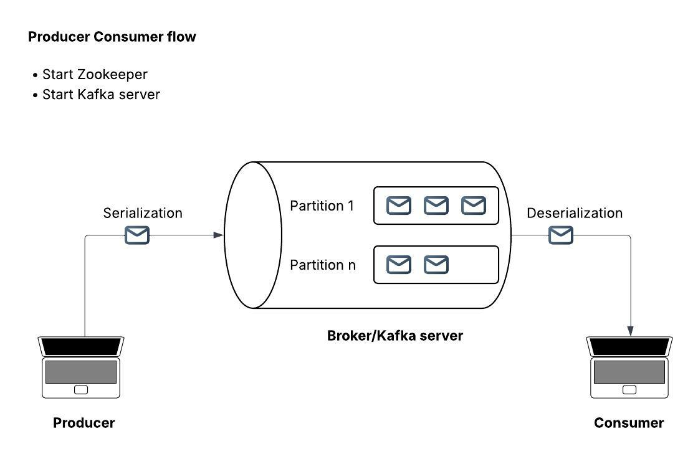
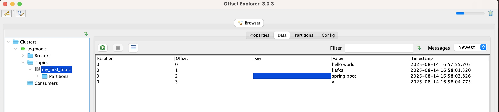
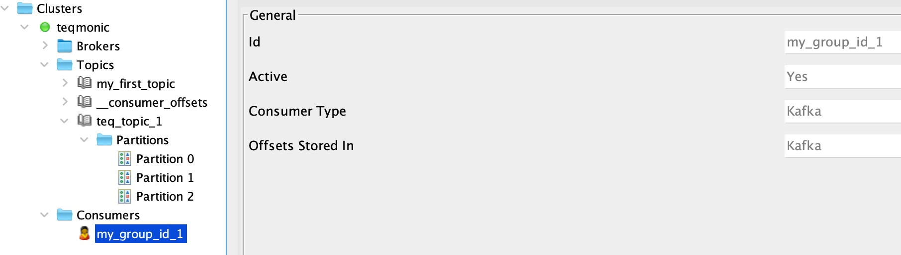

### Spring Boot Kafka

#### Technologies and Tools
* Java 21
* Maven
* sdkman
* Kafka

#### SDKMAN
Using .**_sdkmanrc_** file we can enable project specific java and maven versions

```
java=21.0.7-tem
maven=3.9.6
```

#### Maven Wrapper
Install maven wrapper to run maven commands on ease.

```
mvn wrapper:wrapper
./mvnw clean build
```

### Kakfa Overview
Apache Kafka is a distributed event streaming platform capable of handling trillions of events a day. It is used for building real-time data pipelines and streaming applications. Kafka
is designed to be fast, scalable, and durable, making it suitable for a wide range of use cases including messaging, website activity tracking, log aggregation, stream processing, and event sourcing.




### Kafka Setup
Make sure you have Kafka and Zookeeper running locally or use Docker to set them up. You can use the provided `docker-compose.yml` file to run Kafka and Zookeeper.

### Kafka Producer
Create Spring Boot Kakfa Producer project using [Spring Initializr](https://start.spring.io/)
port:8090

### Run Kafka and Zookeeper using Docker Compose

```
 CD spring-boot-kafka
 ./docker compose -f docker-compose.yml up -d 
 >> docker ps
```
### Steps to publish and consume messages using kafka container and Kafka CLI

```
>> docker exec -it (<container_name>)kafka /bin/sh
>> cd /opt/kafka_2.13-2.8.1/bin
>> kafka-topics.sh --create --zookeeper zookeeper:2181 --replication-factor 1 --partitions 1 --topic my_first_topic
>> kafka-producer.sh --bootstrap-server localhost:9092 --topic my_first_topic

>> kafka-consumer.sh --bootstrap-server localhost:9092 --topic my_first_topic --from-beginning
>> kafka-console-consumer.sh --bootstrap-server localhost:9092 --topic my_topic_1  --partition 0

>> kafka-topics.sh --list --bootstrap-server localhost:9092
>> kafka-topics.sh --describe --topic my_topic_1 --bootstrap-server localhost:9092
```
* _**bootstrap-server**_ specifies where Kafka server is currently running
* **_partitions_** - Kafka topic can be divided into multiple partitions to achieve parallelism and scalability.
* **_replication-factor_** - Kafka topic can be replicated across multiple brokers to ensure high availability and fault tolerance.  Kind of backup.
* Need to specify '--bootstrap-server' property to list topics

We can open separate terminals for producer and consumer(multiple) to publish and consume messages from topic. We can see messages were broadcasted and consumed by
all consumers connected to the topic. 

### Consumer Group
A consumer group is a collection of consumers that work together to consume messages from a Kafka topic. Each consumer in the group is responsible for consuming messages from one or more partitions of the topic. Kafka ensures that each partition is consumed by only one consumer within the group, allowing for parallel processing and load balancing.

In the above exercise, we saw that each consumer received all the messages published to the topic. But if we made assign them to a single group, then only 1 consumer will receive messages.

```
>> kafka-consumer.sh --bootstrap-server localhost:9092 --topic my_first_topic --from-beginning --group my_group_id_1
>> kafka-consumer.sh --bootstrap-server localhost:9092 --topic my_first_topic --from-beginning --group my_group_id_1
```
In the above example, both consumers are part of the same consumer group (my_group_id_1). As a result, only one of the consumers will receive messages from the topic, while the other consumer will be idle. This is because Kafka ensures that each partition is consumed by only one consumer within the group, allowing for parallel processing and load balancing. If you want both consumers to receive messages, you can assign them to different consumer groups.
We can see status such as Lag and Offset for each consumer group using below command

```
>> kafka-consumer-groups.sh --bootstrap-server localhost:9092 --describe --group my_group_id_1
```
We cannot specify --partition along with --group option. Each consumer in a group is automatically assigned to consume messages from one or more partitions of the topic, and Kafka ensures that each partition is consumed by only one consumer within the group. If you want to consume messages from a specific partition, you can do so without using consumer groups, but in that case, you won't get the benefits of load balancing and parallel processing provided by consumer groups.

#### Use case:

If there are too many traffic for a topic, we can create multiple consumer instances to consume messages from the topic for the same consumer group.

You can view the messages using Offset Explorer or any other Kafka GUI tool as well.



### Kafka Producer through Spring Boot Application

```
spring:
  kafka:
    producer:
      bootstrap-servers: localhost:9092
      key-serializer: org.apache.kafka.common.serialization.StringSerializer
      value-serializer: org.springframework.kafka.support.serializer.JsonSerializer
```

**Producer**
```
@Autowired
 private KafkaTemplate<String, Object> template;
 
  public void publishMessageToTopic(String message) {
        CompletableFuture<SendResult<String, Object>> future = template.send("teq_topic_1", message);
        future.whenComplete((result, ex) -> {
            if (ex == null)
                logger.info("Sent message=[{}] with offset=[{}] partition {}",
                        message, result.getRecordMetadata().offset(), result.getRecordMetadata().partition());
            else
                logger.error("Unable to send message=[{}] due to {} ", message, ex.getMessage());
        });
    }
```

### Test through Spring Boot Application

```
GET http://127.0.0.1:8091/api/publish/testmessage1
```
### Kafka Consumer 

port:8091

Provide kafka bootstrap server configuration
```
spring.kafkaconsumer.bootstrap-servers: ${KAFKA_BOOTSTRAP_SERVERS:localhost:9092}
```


Single consumer: Group Id (my_group_id_1) is configured to connect to all partitions of the topic
```
o.s.k.l.KafkaMessageListenerContainer    : my_group_id_1: partitions assigned: [teq_topic_1-0, teq_topic_1-1, teq_topic_1-2]
```
If there are multiple consumer instance then Zookeeper will assign partitions to each consumer instance.

We can configure consumer to consume message from a particular partition as well.

### Kafka Object Serialization and Deserialization

If we publish any object to kafka topic, we need to serialize the object before sending it to topic and deserialize it while consuming the message from topic.
We would encounter below SerializationException if we don't configure serializer and deserializer properly.

Incase of string message, we don't need to configure serializer and deserializer explicitly as StringSerializer and StringDeserializer are default and 
string messages can be converted to Byte array as expected by Kafka.

```
{
  "timestamp": "2025-08-27T19:57:00.513+00:00",
  "status": 500,
  "error": "Internal Server Error",
  "trace": "org.apache.kafka.common.errors.SerializationException: Can't convert value of class com.kafka.producer.dto.User to class org.apache.kafka.common.serialization.StringSerializer specified in value.serializer\n\tat org.apache.kafka.clients.producer.KafkaProducer.doSend(KafkaProducer.java:1049)\n\tat org.apache.kafka.clients.producer.KafkaProducer.send(KafkaProducer.java:993)\n\tat org.springframework.kafka.core.DefaultKafkaProducerFactory$CloseSafeProducer.send(DefaultKafkaProducerFactory.java:1103)\n\tat org.springframework.kafka.core.KafkaTemplate.doSend(KafkaTemplate.java:852)\n\tat org.springframework.kafka.core.KafkaTemplate.observeSend(KafkaTemplate.java:820)\n\tat org.springframework.kafka.core.KafkaTemplate.send(KafkaTemplate.java:597)\n\tat com.kafka.producer.service.KafkaMessagePublisher.publishMessageToTopic(KafkaMessagePublisher.java:35)\n\tat com.kafka.producer.controller.EventController.publishUserMessage(EventController.java:44)\n\tat java.base/jdk.internal.reflect.DirectMethodHandleAccessor.invoke(DirectMethodHandleAccessor.java:103)\n\tat java.base/java.lang.reflect.Method.invoke(Method.java:580)\n\tat org.springframework.web.method.support.InvocableHandlerMethod.doInvoke(InvocableHandlerMethod.java:258)\n\tat org.springframework.web.method.support.InvocableHandlerMethod.invokeForRequest(InvocableHandlerMethod.java:191)\n\tat org.springframework.web.servlet.mvc.method.annotation.ServletInvocableHandlerMethod.invokeAndHandle(ServletInvocableHandlerMethod.java:118)\n\tat org.springframework.web.servlet.mvc.method.annotation.RequestMappingHandlerAdapter.invokeHandlerMethod(RequestMappingHandlerAdapter.java:986)\n\tat org.springframework.web.servlet.mvc.method.annotation.RequestMappingHandlerAdapter.handleInternal(RequestMappingHandlerAdapter.java:891)\n\tat org.springframework.web.servlet.mvc.method.AbstractHandlerMethodAdapter.handle(AbstractHandlerMethodAdapter.java:87)\n\tat org.springframework.web.servlet.DispatcherServlet.doDispatch(DispatcherServlet.java:1089)\n\tat org.springframework.web.servlet.DispatcherServlet.doService(DispatcherServlet.java:979)\n\tat org.springframework.web.servlet.FrameworkServlet.processRequest(FrameworkServlet.java:1014)\n\tat org.springframework.web.servlet.FrameworkServlet.doPost(FrameworkServlet.java:914)\n\tat jakarta.servlet.http.HttpServlet.service(HttpServlet.java:590)\n\tat org.springframework.web.servlet.FrameworkServlet.service(FrameworkServlet.java:885)\n\tat jakarta.servlet.http.HttpServlet.service(HttpServlet.java:658)\n\tat org.apache.catalina.core.ApplicationFilterChain.internalDoFilter(ApplicationFilterChain.java:195)\n\tat org.apache.catalina.core.ApplicationFilterChain.doFilter(ApplicationFilterChain.java:140)\n\tat org.apache.tomcat.websocket.server.WsFilter.doFilter(WsFilter.java:51)\n\tat org.apache.catalina.core.ApplicationFilterChain.internalDoFilter(ApplicationFilterChain.java:164)\n\tat org.apache.catalina.core.ApplicationFilterChain.doFilter(ApplicationFilterChain.java:140)\n\tat org.springframework.web.filter.RequestContextFilter.doFilterInternal(RequestContextFilter.java:100)\n\tat org.springframework.web.filter.OncePerRequestFilter.doFilter(OncePerRequestFilter.java:116)\n\tat org.apache.catalina.core.ApplicationFilterChain.internalDoFilter(ApplicationFilterChain.java:164)\n\tat org.apache.catalina.core.ApplicationFilterChain.doFilter(ApplicationFilterChain.java:140)\n\tat org.springframework.web.filter.FormContentFilter.doFilterInternal(FormContentFilter.java:93)\n\tat org.springframework.web.filter.OncePerRequestFilter.doFilter(OncePerRequestFilter.java:116)\n\tat org.apache.catalina.core.ApplicationFilterChain.internalDoFilter(ApplicationFilterChain.java:164)\n\tat org.apache.catalina.core.ApplicationFilterChain.doFilter(ApplicationFilterChain.java:140)\n\tat org.springframework.web.filter.ServerHttpObservationFilter.doFilterInternal(ServerHttpObservationFilter.java:114)\n\tat org.springframework.web.filter.OncePerRequestFilter.doFilter(OncePerRequestFilter.java:116)\n\tat org.apache.catalina.core.ApplicationFilterChain.internalDoFilter(ApplicationFilterChain.java:164)\n\tat org.apache.catalina.core.ApplicationFilterChain.doFilter(ApplicationFilterChain.java:140)\n\tat org.springframework.web.filter.CharacterEncodingFilter.doFilterInternal(CharacterEncodingFilter.java:201)\n\tat org.springframework.web.filter.OncePerRequestFilter.doFilter(OncePerRequestFilter.java:116)\n\tat org.apache.catalina.core.ApplicationFilterChain.internalDoFilter(ApplicationFilterChain.java:164)\n\tat org.apache.catalina.core.ApplicationFilterChain.doFilter(ApplicationFilterChain.java:140)\n\tat org.apache.catalina.core.StandardWrapperValve.invoke(StandardWrapperValve.java:167)\n\tat org.apache.catalina.core.StandardContextValve.invoke(StandardContextValve.java:90)\n\tat org.apache.catalina.authenticator.AuthenticatorBase.invoke(AuthenticatorBase.java:483)\n\tat org.apache.catalina.core.StandardHostValve.invoke(StandardHostValve.java:116)\n\tat org.apache.catalina.valves.ErrorReportValve.invoke(ErrorReportValve.java:93)\n\tat org.apache.catalina.core.StandardEngineValve.invoke(StandardEngineValve.java:74)\n\tat org.apache.catalina.connector.CoyoteAdapter.service(CoyoteAdapter.java:344)\n\tat org.apache.coyote.http11.Http11Processor.service(Http11Processor.java:398)\n\tat org.apache.coyote.AbstractProcessorLight.process(AbstractProcessorLight.java:63)\n\tat org.apache.coyote.AbstractProtocol$ConnectionHandler.process(AbstractProtocol.java:903)\n\tat org.apache.tomcat.util.net.NioEndpoint$SocketProcessor.doRun(NioEndpoint.java:1740)\n\tat org.apache.tomcat.util.net.SocketProcessorBase.run(SocketProcessorBase.java:52)\n\tat org.apache.tomcat.util.threads.ThreadPoolExecutor.runWorker(ThreadPoolExecutor.java:1189)\n\tat org.apache.tomcat.util.threads.ThreadPoolExecutor$Worker.run(ThreadPoolExecutor.java:658)\n\tat org.apache.tomcat.util.threads.TaskThread$WrappingRunnable.run(TaskThread.java:63)\n\tat java.base/java.lang.Thread.run(Thread.java:1583)\nCaused by: java.lang.ClassCastException: class com.kafka.producer.dto.User cannot be cast to class java.lang.String (com.kafka.producer.dto.User is in unnamed module of loader org.springframework.boot.devtools.restart.classloader.RestartClassLoader @460d8829; java.lang.String is in module java.base of loader 'bootstrap')\n\tat org.apache.kafka.common.serialization.StringSerializer.serialize(StringSerializer.java:31)\n\tat org.apache.kafka.common.serialization.Serializer.serialize(Serializer.java:62)\n\tat org.apache.kafka.clients.producer.KafkaProducer.doSend(KafkaProducer.java:1046)\n\t... 59 more\n",
  "message": "Can't convert value of class com.kafka.producer.dto.User to class org.apache.kafka.common.serialization.StringSerializer specified in value.serializer",
  "path": "/api/publish/user"
}
```
Serialization and Deserialization can be configured in application properties file as below. 
We can use JsonSerializer and JsonDeserializer provided by Spring Kafka to serialize and deserialize objects to and from JSON format.
```
spring:
  kafka:
    producer:
      bootstrap-servers: localhost:9092
      key-serializer: org.apache.kafka.common.serialization.StringSerializer
      value-serializer: org.springframework.kafka.support.serializer.JsonSerializer
```

```
spring:
  kafka:
    consumer:
      bootstrap-servers: ${KAFKA_BOOTSTRAP_SERVERS:localhost:9092}
      key-deserializer: org.apache.kafka.common.serialization.StringDeserializer
      value-deserializer: org.springframework.kafka.support.serializer.JsonDeserializer
      properties:
        spring.json.trusted.packages: com.kafka.common.dto
```


