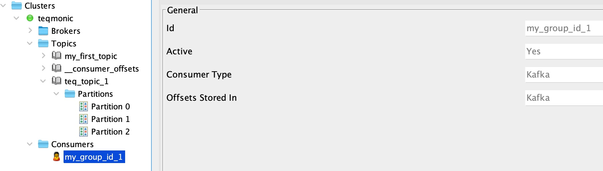

### Spring Boot Kafka

#### Technologies and Tools
* Java 21
* Maven
* sdkman
* Kafka

#### SDKMAN
Using .**_sdkmanrc_** file we can enable project specific java and maven versions

```
java=21.0.7-tem
maven=3.9.6
```

#### Maven Wrapper
Install maven wrapper to run maven commands on ease.

```
mvn wrapper:wrapper
./mvnw clean build
```


### Kafka Setup
Make sure you have Kafka and Zookeeper running locally or use Docker to set them up. You can use the provided `docker-compose.yml` file to run Kafka and Zookeeper.

### Kafka Producer
Create Spring Boot Kakfa Producer project using [Spring Initializr](https://start.spring.io/)
port:8090

### Run Kafka and Zookeeper using Docker Compose

```
 CD spring-boot-kafka
 ./docker compose -f docker-compose.yml up -d 
 >> docker ps
```
### Steps to publish and consume messages using kafka container

```
>> docker exec -it (<container_name>)kafka /bin/sh
>> cd /opt/kafka_2.13-2.8.1/bin
>> kafka-topics.sh --create --zookeeper zookeeper:2181 --replication-factor 1 --partitions 1 --topic my_first_topic
>> kafka-producer.sh --bootstrap-server localhost:9092 --topic my_first_topic

>> kafka-consumer.sh --bootstrap-server localhost:9092 --topic my_first_topic --from-beginning
```
You can view the messages using Offset Explorer or any other Kafka GUI tool as well.


### Test through Spring Boot Application

```
GET http://127.0.0.1:8091/api/publish/testmessage1
```
### Kafka Consumer 

port:8091

Provide kafka bootstrap server configuration
```
spring.kafkaconsumer.bootstrap-servers: ${KAFKA_BOOTSTRAP_SERVERS:localhost:9092}
```


Single consumer: Group Id (my_group_id_1) is configured to connect to all partitions of the topic
```
o.s.k.l.KafkaMessageListenerContainer    : my_group_id_1: partitions assigned: [teq_topic_1-0, teq_topic_1-1, teq_topic_1-2]
```
If there are multiple consumer instance then Zookeeper will assign partitions to each consumer instance.


